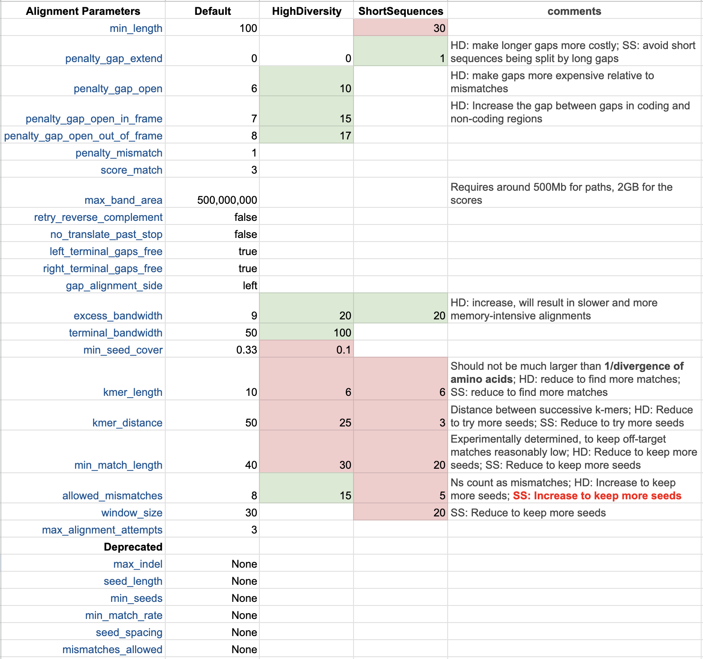
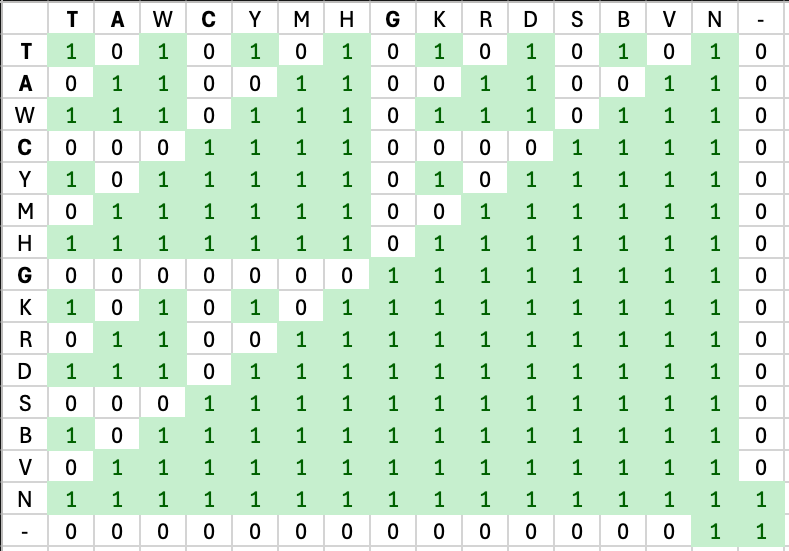
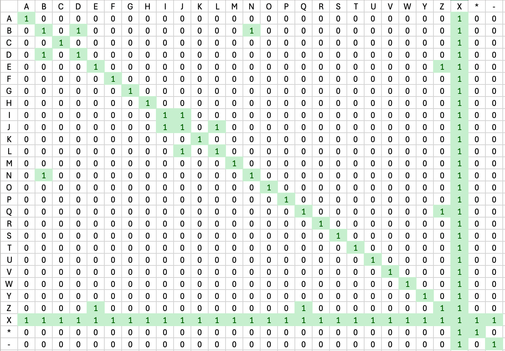
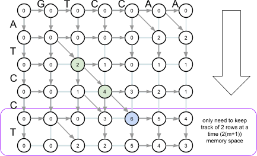
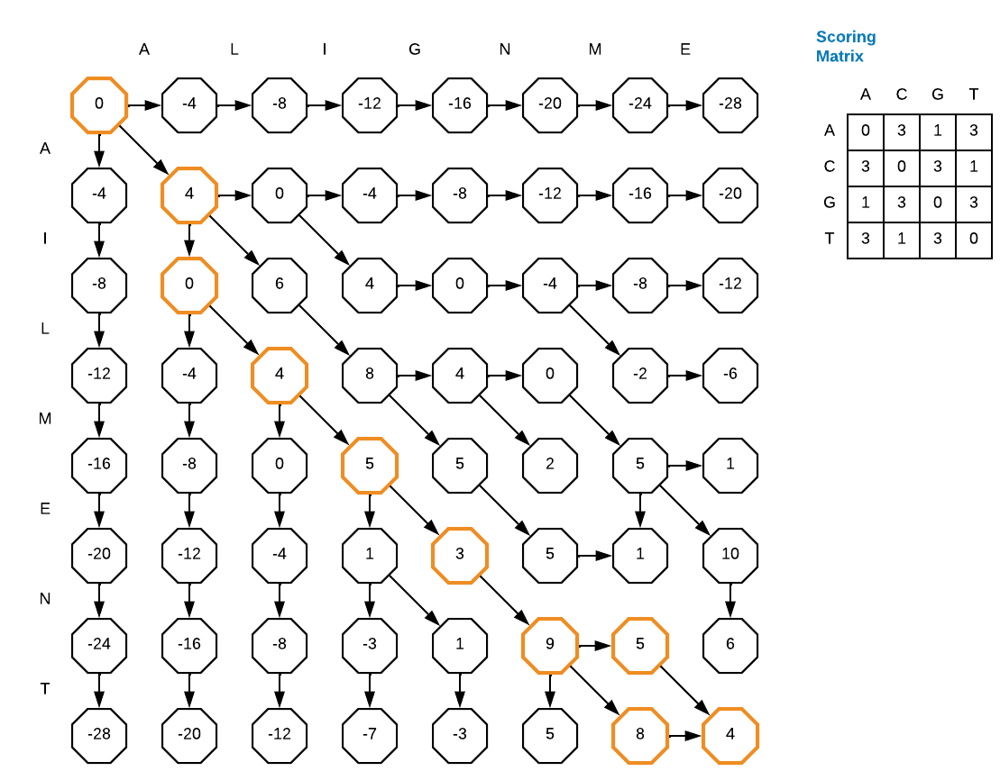

# Nextclade alignment
## Alignment Parameters

Look at the [source code](https://github.com/nextstrain/nextclade/blob/25f5172d0c37d6694475483809ff42f8c0e66bcd/packages/nextclade/src/align/params.rs#L26) to infer the parameters:

## Scoring Matrix

Scoring matrix where "high" is good. Just 1 for match (or near match) and 0 for mismatch.

| Nucleotide [Scoring Matrix](https://github.com/nextstrain/nextclade/blob/master/packages/nextclade/src/align/score_matrix_nuc.rs) | Amino Acid [Scoring Matrix](https://github.com/nextstrain/nextclade/blob/master/packages/nextclade/src/align/score_matrix_aa.rs) |
| :-------------------------------------------------------------------------------------------------------------------------------- | :------------------------------------------------------------------------------------------------------------------------------- |
|                                                                                                |                                                                                                |

There are [many possible scoring matrices](https://en.wikipedia.org/wiki/Substitution_matrix) depending on the evolution we expect to see in the data.

## Alignment

* Swiss-Waterman Alignment
	* dynamic programming pairwise alignments
* Banded
	* Pro: smaller memory footprint
	* Con: if band is not sufficiently large, can miss best alignment (stuck in local maximum)
* Seed based

Nearest figure I generated for BCB 567 class in 2011; however, I think in Nextclade the band is diagonal (so more like a trapazoid or backslash shape)

Perhaps fixup a figure similar to but with a shape around the band (and what `excess-bandwidth` vs `terminal-bandwidth` means):

